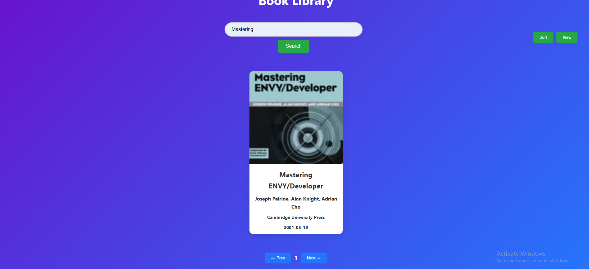
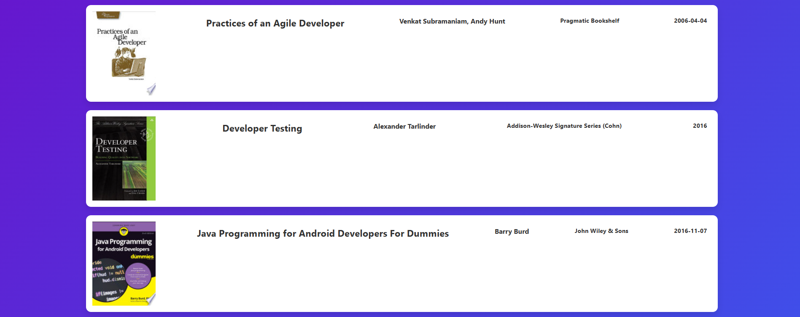
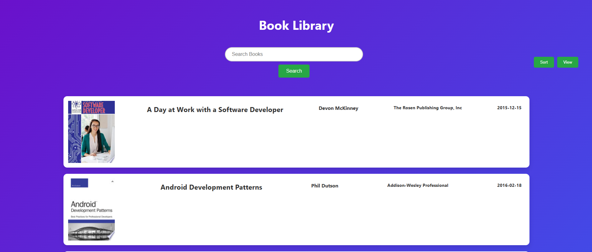

<h1> 📚 Book Library

# 🚀 Live Demo: [Book Library](https://subtle-speculoos-fdc721.netlify.app/)

## 🛠️ Tech Stack

HTML: Structure and layout

CSS: Styling and responsiveness

JavaScript: Dynamic content rendering and API integration

# 🌟 Features

## ✅ Dynamic Book Fetching:

Fetches book data from the FreeAPI.app dynamically.

Displays book details including:

Title

Author

Publisher

Published date

Thumbnail

## ✅ List/Grid View Toggle:

Switch between list and grid view for better browsing experience.

## ✅ Search Functionality:

Filter books by title or author in real-time.

## ✅ Sorting Options:

Sort books alphabetically by title.

Sort by release date (publishedDate).

## ✅ Pagination:

Automatically loads the next set of books when scrolling to the bottom of the page.

## ✅ Book Details in New Tab:

Clicking on a book opens more details in a new tab using the infoLink.

## ✅ Responsive Design:

Fully responsive and mobile-friendly interface.

## ⚙️ Usage

Use the search bar to filter books by title or author.

Switch between list and grid views for a better browsing experience.

Sort the books alphabetically or by release date.

Click on any book to open more details in a new tab.

## 🖼️ Screenshots
### 📚 Book Grid View
 

### 🔍 Search Functionality and 📅 Pagination

### 📅 Grid and List view

### 📅 Sort books alphabetically by title and Publsh date

# 🚀 Deployment
The website is deployed on: [Netlify](https://subtle-speculoos-fdc721.netlify.app/)
🌐

## 📝 API Reference
Endpoint:

https://api.freeapi.app/api/v1/public/books

Documentation:
[FreeAPI.app Documentation](https://freeapi.hashnode.space/api-guide/apireference/getBooks)